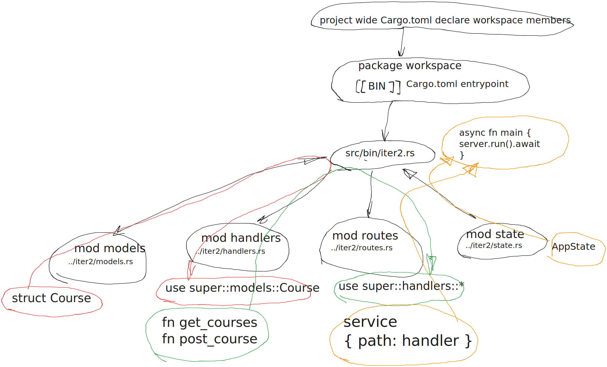

# Rust Servers, Services, and Apps
[walkthrough `Rust Servers, Services, and Apps`](https://www.manning.com/books/rust-servers-services-and-apps)

## Notes

- we can add custom path to a file if we don't want to follow default filestructure
```rust
#[path = "../handlers.rs"]
mod handlers;
```

- it will follow `request, route, handler, reponse`
```sh
curl -ivX POST localhost:3000/courses/ -H "Content-Type: application/json" \
-d '{"tutor_id":1, "course_name":"Hello , my first course  !"}'
# Note: Unnecessary use of -X or --request, POST is already inferred.
# it seems like when attaching data via `-d` it is already POST as default
curl localhost:3000/courses/ -H "Content-Type: applicatoin/json" -d '{"tutor_id":1,"course_name":"without explicit post"}'
```

- those 2 have to be set
```sh
export PROJECT_ROOT=.
export DATABASE_USER=truuser
```

```sh
sudo -i -u postgres
psql
```

```sql
CREATE DATABASE ezytutors;
CREATE USER truuser WITH PASSWORD 'mypassword';
GRANT ALL PRIVILEGES ON DATABASE ezytutors TO truuser;
```

- https://stackoverflow.com/a/18664239 change `local all postgres   peer` to `md5`
then `/etc/init.d/postgresql reload`
    
```sh
psql -U $DATABASE_USER -d ezytutors --password
PGPOSTGRES psql -U $DATABASE_USER -d ezytutors
```

```sh
psql -U $DATABASE_USER -d ezytutors < $PROJECT_ROOT/src/database.sql
cargo run --bin iter1 -p tutor-db
```

- second iteration suggested filestructure


- `sqlx::query!(...).exectue(pool).await` will execute *without* returning
- as opposite to `.fetch_one` `.fetch_all`
